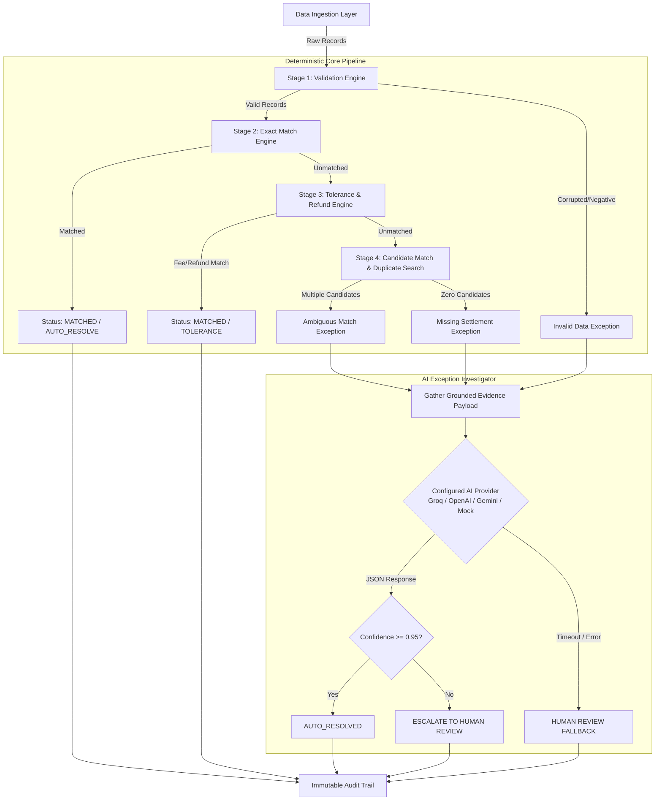
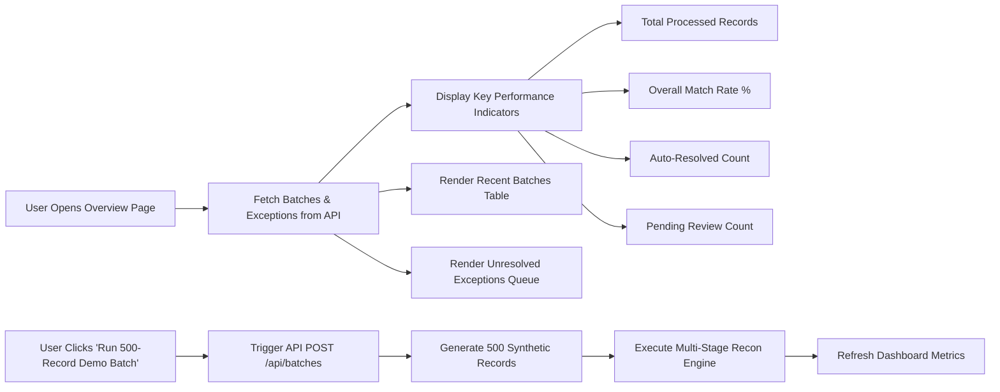
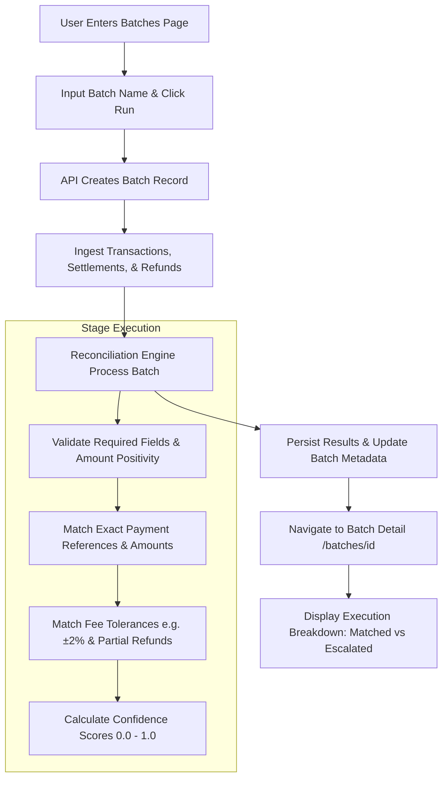
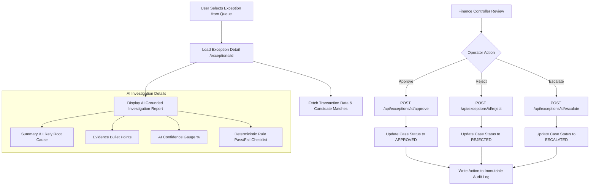
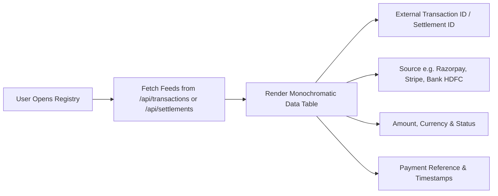
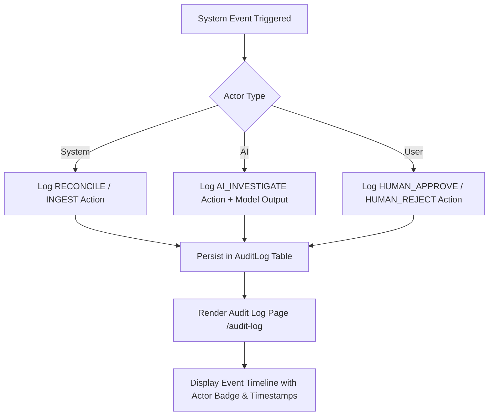
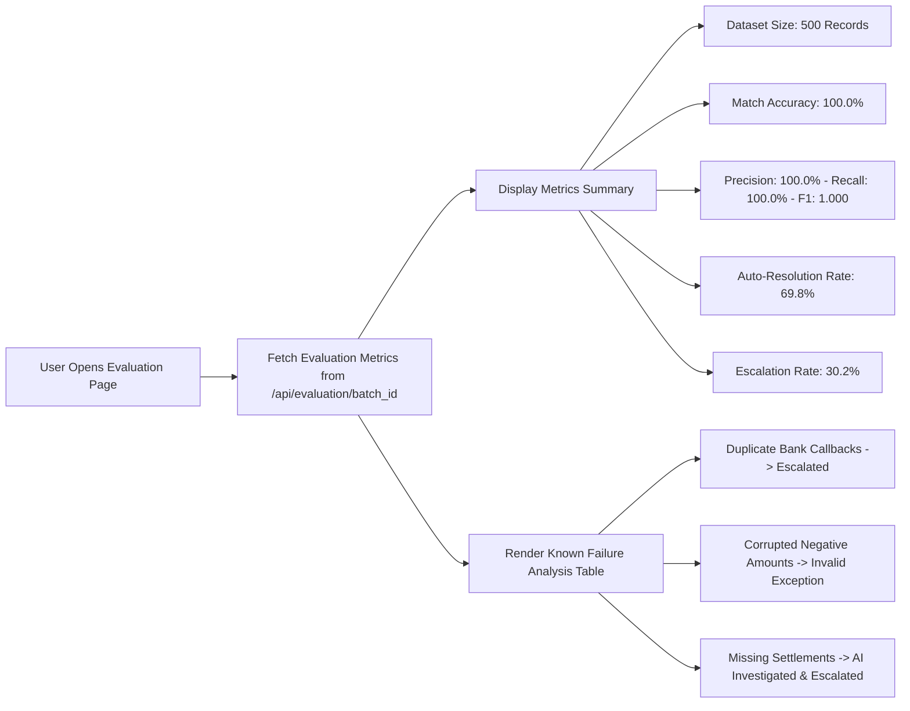

# LedgerLens AI

**Autonomous financial reconciliation with intelligent exception investigation.**

Built for **Razorpay Buildathon — Track 4: AI Finance Controller**.

---

## 🎯 Executive Summary & Core Principle

Financial operations teams manually reconcile transactions, settlements, and bank records across disparate systems. 

**LedgerLens AI** solves this by strictly separating **Deterministic Matching** from **AI Exception Investigation**:
- **Deterministic Engine**: Handles transaction ID matching, fee variance tolerances, partial refund adjustments, date windows, and duplicate detection with 100% mathematical accuracy.
- **AI Investigator**: Invoked only for ambiguous exceptions. It analyzes structured evidence, calculates confidence scores, automatically resolves safe cases (`confidence >= 0.95`), and escalates uncertain ones with clear reasoning for human review.

---

## 📐 Overall System Architecture & Engine Flowchart



---

## 🖥 PAGE-BY-PAGE WORKFLOWS & FLOWCHARTS

### 1. Overview Dashboard (`/`)

The Overview page serves as the mission control for finance controllers, displaying real-time batch statistics, system health, match rates, and active exceptions.



**Key Features**:
- Live performance counters (Match Rate, Auto-Resolved vs Escalated).
- One-click **Run 500-Record Demo Batch** trigger.
- Quick navigation to active exception cases and recent batch execution logs.

---

### 2. Batch Processing & Detail Workspace (`/batches` & `/batches/[id]`)

Allows users to create reconciliation batches, run batch execution, and inspect exact matching outputs.



**Key Features**:
- Custom batch creation with synthetic dataset generation (500 records with 10 test scenarios).
- Batch Detail page displaying record-by-record match type (`EXACT`, `TOLERANCE`, `AMBIGUOUS`), confidence score, amount variance, and decision.

---

### 3. Exceptions Queue & AI Investigation Workspace (`/exceptions` & `/exceptions/[id]`)

The core workspace for investigating unmatched, ambiguous, or fee-mismatched cases.



**Key Features**:
- Multi-criteria queue filtering (by status: `PENDING_REVIEW`, `ESCALATED`, `APPROVED`, or type: `amount_mismatch`, `missing_settlement`, `duplicate_reference`).
- **Grounded Evidence Panel**: AI-generated root cause explanations based strictly on record data.
- **Deterministic Rule Checklist**: Visual pass/fail status for Reference Match, Amount Tolerance, and Duplicate Check.
- **Human Decision Buttons**: Approve Resolution, Reject Recommendation, or Escalate Case with operator resolution notes.

---

### 4. Transactions & Bank Settlements Registries (`/transactions` & `/settlements`)

Searchable, high-density data tables displaying raw ingested transaction feeds and bank settlement records.



---

### 5. Audit Log Timeline (`/audit-log`)

Provides a complete, immutable audit trail of system, AI, and human actions for compliance and oversight.



---

### 6. Evaluation & Benchmark Dashboard (`/evaluation`)

Demonstrates system accuracy and transparency by evaluating predicted reconciliation results against ground-truth dataset annotations.



---

## 🛠 Tech Stack & Environment Setup

- **Frontend**: Next.js 14, TypeScript, Tailwind CSS, Lucide Icons
- **Backend**: Python 3.12, FastAPI, Pydantic v2, SQLAlchemy
- **Database**: PostgreSQL / SQLite fallback
- **AI Providers**: Groq (`llama-3.3-70b-versatile`), OpenAI, Gemini, Standalone Mock Provider
- **Testing**: Pytest

### Quick Start Commands

```bash
# Setup backend dependencies
make setup

# Generate synthetic 500-record dataset with ground-truth
make generate-data

# Run Pytest suite
make test

# Run evaluation suite
make run-eval

# Start API Backend (Port 8000)
make run-api

# Start Web Dashboard (Port 3005)
make run-web
```

---

## 📄 Complete Project Documentation

- [Architecture Guide](docs/architecture.md)
- [Architectural Decision Records (ADRs)](docs/decisions.md)
- [Evaluation Methodology](docs/evaluation.md)
