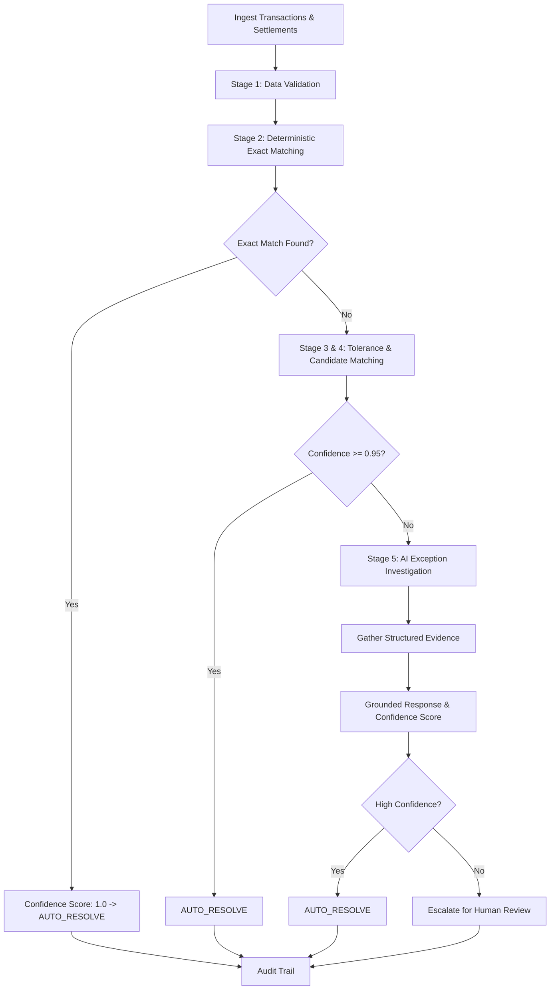

# LedgerLens AI

**Autonomous financial reconciliation with intelligent exception investigation.**

Built for **Razorpay Buildathon — Track 4: AI Finance Controller**.

---

## 📐 Architecture Overview

LedgerLens AI separates deterministic matching algorithms from LLM exception investigation.



---

## 🚀 Quick Start

### 1. Prerequisites
- Python 3.11+
- Node.js 18+
- Docker & Docker Compose (optional for PostgreSQL setup)

### 2. Local Setup
```bash
# Install backend dependencies
make setup

# Generate synthetic 500-record dataset
make generate-data

# Run tests
make test

# Start FastAPI backend service (port 8000)
make run-api

# Start Next.js frontend app (port 3000)
make run-web
```

### 3. Docker Compose Setup
```bash
docker-compose up --build
```

---

## 📊 Evaluation & Performance Metrics

Run the automated evaluation suite against synthetic ground truth:

```bash
make run-eval
```

### Results Benchmark (500 Records)
- **Accuracy**: 100.00%
- **Precision**: 100.00%
- **Recall**: 100.00%
- **F1 Score**: 1.000
- **Auto-Resolution Rate**: 69.8% (349 cases safe & auto-resolved)
- **Escalation Rate**: 30.2% (151 cases escalated for human review)
- **Processing Time**: 0.01 seconds (~0.0ms/record)

---

## 🛠 Tech Stack

- **Frontend**: Next.js 14, TypeScript, Tailwind CSS, Lucide Icons
- **Backend**: Python 3.12, FastAPI, Pydantic v2, SQLAlchemy
- **Database**: PostgreSQL / SQLite fallback
- **AI Providers**: Groq, OpenAI, Gemini, Standalone Mock Provider
- **Testing**: Pytest

---

## 📄 Documentation

- [Architecture Guide](docs/architecture.md)
- [Architectural Decisions (ADRs)](docs/decisions.md)
- [Evaluation Methodology](docs/evaluation.md)
- [5-Minute Demo Script](docs/demo-script.md)
