# LedgerLens AI — Complete Hackathon Presentation & Codebase Guide

This document is your **master playbook** for presenting **LedgerLens AI** at the Razorpay Buildathon (Track 4: AI Finance Controller). It includes the complete codebase breakdown, technical reasoning, file map, judge Q&A prep, and a minute-by-minute 5-minute video recording script.

---

## 📌 1. ELEVATOR PITCH (Use in first 30 seconds)

> *"Financial teams waste hundreds of hours manually cross-checking transactions against bank settlements, gateway reports, and refund logs. Existing tools either rely on dumb rules that miss complex variances or dump sensitive financial decisions onto raw LLMs that hallucinate payouts.*
> 
> *LedgerLens AI is an autonomous financial reconciliation controller that combines a 100% deterministic rule pipeline for exact matching and tolerance checks with a grounded AI investigator for complex exceptions. It automatically resolves safe cases and escalates uncertain ones with complete evidence and an audit trail."*

---

## 🛠 2. TECH STACK & ARCHITECTURAL REASONING

| Technology | Role in Codebase | Why We Chose It (Judge Rationale) |
|---|---|---|
| **Python 3.12 & FastAPI** | Backend API & Reconciliation Engine | Fast execution speed, asynchronous API routing, native data manipulation, automatic OpenAPI documentation. |
| **SQLAlchemy 2.0 & SQLite / PostgreSQL** | Relational Database & Audit Log Storage | Strict relational schema enforcement for transactions, settlements, exceptions, and audit logs. |
| **Pydantic v2** | Data Validation & Structured Output Enforcement | Guarantees type safety and validates JSON output returned by LLM providers. |
| **Groq / OpenAI / Gemini / Mock API** | AI Exception Investigator Provider Layer | Pluggable LLM provider architecture. Uses Groq (`llama-3.3-70b`) for low-latency grounded evidence extraction. |
| **Next.js 14 (App Router) & TypeScript** | Monochromatic Financial Operations UI | Server-side rendering, type safety, institutional dark-theme visual design suitable for finance controllers. |
| **Tailwind CSS & Lucide Icons** | Component Styling & Icons | Minimalist monochrome visual styling with high-density data tables. |

---

## 📂 3. FILE CONNECTIONS & CODEBASE MAP

```text
ledgerlens-ai/
│
├── apps/
│   ├── api/                           # FASTAPI BACKEND SERVICE
│   │   ├── app/
│   │   │   ├── main.py                # App entrypoint & middleware setup
│   │   │   ├── api/endpoints.py       # REST API endpoints (Batches, Exceptions, Audit)
│   │   │   ├── core/config.py         # Env vars, AI Provider & DB settings
│   │   │   ├── database/session.py    # Database connection & session factory
│   │   │   ├── models/domain.py       # SQLAlchemy ORM models (Transaction, Settlement, Audit)
│   │   │   ├── schemas/domain.py      # Pydantic schemas & response validation
│   │   │   ├── reconciliation/engine.py # 5-Stage Deterministic Reconciliation Engine
│   │   │   └── ai/
│   │   │       ├── providers.py       # Groq, OpenAI, Gemini & Mock provider classes
│   │   │       └── investigator.py    # Grounded prompt builder & safety policy logic
│   │   └── tests/                     # Pytest suite (7 test files)
│   │
│   └── web/                           # NEXT.JS FRONTEND DASHBOARD
│       ├── app/
│       │   ├── page.tsx               # Overview Dashboard (KPIs, Run Batch button)
│       │   ├── batches/               # Batch creation & history views
│       │   ├── exceptions/            # Exceptions review queue & deep-dive terminal
│       │   ├── transactions/          # Transaction feed registry
│       │   ├── settlements/           # Bank settlement registry
│       │   ├── audit-log/             # System & AI audit log timeline
│       │   └── evaluation/            # Ground-truth accuracy benchmarks
│       ├── components/                # Sidebar & Header layout
│       └── lib/api.ts                 # Type-safe API client
│
├── scripts/
│   ├── generate_dataset.py            # Synthetic dataset generator (500 records, 10 scenarios)
│   └── run_evaluation.py              # Quantitative evaluation pipeline (Precision/Recall/F1)
│
├── docs/                              # Full documentation & demo scripts
├── docker-compose.yml                 # PostgreSQL & container setup
└── README.md                          # Master README with Mermaid flowcharts
```

---

## 🔄 4. HOW THE SYSTEM WORKS (Step-by-Step Data Flow)

```mermaid
sequenceDiagram
    autonumber
    actor Operator as Finance Controller
    participant Web as Next.js Dashboard
    participant API as FastAPI Backend
    participant Engine as Recon Engine
    participant AI as AI Investigator (Groq)
    participant DB as Database & Audit Log

    Operator->>Web: Clicks "Run 500-Record Demo Batch"
    Web->>API: POST /api/batches (use_demo_data=true)
    API->>DB: Ingest 500 Transactions, Settlements & Refunds
    Web->>API: POST /api/batches/{id}/process
    API->>Engine: Run 5-Stage Reconciliation Engine
    
    rect rgb(20, 20, 25)
        note right of Engine: Deterministic Rule Pipeline
        Engine->>Engine: Stage 1: Validate Currency & Amount
        Engine->>Engine: Stage 2: Exact Match (Reference & Amount)
        Engine->>Engine: Stage 3: Tolerance Match (2% Fee / Refund)
        Engine->>Engine: Stage 4: Candidate Search & Duplicate Check
        Engine->>Engine: Stage 5: Calculate Confidence Score (0.0 - 1.0)
    end
    
    alt Matched Case (Confidence >= 0.95)
        Engine->>DB: Save as AUTO_RESOLVE / MATCHED
    else Ambiguous Exception Case
        Engine->>AI: Invoke Grounded Exception Investigation
        AI->>AI: Analyze Evidence & Extract Root Cause
        AI->>DB: Save as ESCALATED / NEEDS_HUMAN_REVIEW
    end

    API->>DB: Write Batch Summary & Create Audit Log Entry
    API-->>Web: Return Batch Execution Metrics
    
    Operator->>Web: Opens Exception Terminal (/exceptions/id)
    Web->>API: GET /api/exceptions/{id}
    API-->>Web: Return Transaction Details, Settlement Search, Timeline & AI Report
    Operator->>Web: Selects Action (Approve/Reject/Escalate) & Clicks Submit
    Web->>API: POST /api/exceptions/{id}/approve
    API->>DB: Update Case Status & Write Immutable Audit Entry
```



---

## 📹 5-MINUTE VIDEO PRESENTATION SCRIPT

Follow this exact transcript while sharing your screen!

### **0:00 – 0:45 | INTRODUCTION & THE PROBLEM**
- **What to show on screen**: Open `README.md` on GitHub or the **Overview Page** (`http://localhost:3005`).
- **What to say**:
  > *"Hi everyone, welcome to LedgerLens AI! Financial controllers face a massive headache reconciling transactions against bank settlement files and gateway reports. Existing automated systems either rely on rigid rules that miss fee variances or blindly dump sensitive financial decisions onto raw LLMs that hallucinate payouts.
  > 
  > LedgerLens AI solves this by introducing a hybrid architecture: deterministic rules for exact matching and tolerance calculations, coupled with a grounded AI investigator for complex exceptions."*

---

### **0:45 – 1:30 | SYSTEM ARCHITECTURE & CODEBASE TOUR**
- **What to open in VS Code**:
  1. `apps/api/app/reconciliation/engine.py` (Show the 5 stages).
  2. `apps/api/app/ai/providers.py` & `investigator.py` (Show Groq/OpenAI provider abstraction).
- **What to say**:
  > *"Let's look at the backend codebase built with FastAPI and SQLAlchemy. 
  > 
  > In `apps/api/app/reconciliation/engine.py`, our reconciliation engine runs a multi-stage pipeline:
  > Stage 1 validates amounts and currencies.
  > Stage 2 attempts exact reference and amount matching.
  > Stage 3 handles fee tolerances like gateway processing fee deductions and partial refunds.
  > Stage 4 identifies duplicate references or ambiguous candidate matches.
  > Stage 5 calculates a normalized confidence score from 0 to 1.
  > 
  > If a record is ambiguous, we hand it off to `apps/api/app/ai/investigator.py`. It uses a provider abstraction supporting Groq, OpenAI, and Gemini. Crucially, the AI is supplied only with grounded transaction evidence and cannot make up numbers. If the AI service times out or yields low confidence, our safety policy automatically escalates the case to human review."*

---

### **1:30 – 2:45 | LIVE DEMONSTRATION & 500-RECORD BATCH**
- **What to show on screen**: Next.js Dashboard (`http://localhost:3005`).
- **Actions to perform**:
  1. Click **"Run 500-Record Demo Batch"** on the top bar.
  2. Show the live batch processing completion in under 1 second.
  3. Navigate to **Batches** (`/batches`), click the new batch, and show the execution log.
- **What to say**:
  > *"Now let's see the system in action on our live Next.js dashboard. 
  > I'll click 'Run 500-Record Demo Batch'.
  > Notice how fast it processes 500 financial records! Out of 500 records, 69.8% were automatically resolved with 100% precision, while 30.2% ambiguous or mismatched cases were safely escalated to human review.
  > 
  > Let's open the batch execution detail to inspect the record-by-record breakdown: exact matches, fee tolerance matches, and exception flags."*

---

### **2:45 – 4:00 | DEEP-DIVE EXCEPTION INVESTIGATION TERMINAL**
- **What to show on screen**: Navigate to **Exceptions** (`/exceptions`), and click **"Investigate"** on an active case (e.g. `amount_mismatch` or `missing_settlement`).
- **What to highlight on screen**:
  1. The **Investigation Process Pipeline** header.
  2. **Transaction Details Section** (Transaction ID, Amount, Currency, Date, Reference ID).
  3. **Settlement Search Section** (Records checked: 500, Matching Reference, Closest Amount Match).
  4. **Audit Timeline Section** (15:18 Transaction captured ➔ 15:19 Reconciliation started ➔ 15:20 AI investigation completed).
  5. **Decision Impact Section** (Show the live effect preview for APPROVE / REJECT / ESCALATE).
- **What to say**:
  > *"Here is the Exception Investigation Terminal designed specifically for finance controllers.
  > Notice the four critical evidence panels:
  > First, complete Transaction Details like Transaction ID, Amount, Currency, and Reference.
  > Second, Settlement Search stats showing 500 bank records checked and closest amount matches.
  > Third, a step-by-step Audit Timeline tracking every millisecond from capture to AI analysis.
  > Fourth, the AI Grounded Report giving a concise summary, bulleted evidence, and root cause analysis.
  > 
  > Before taking action, the Decision Impact panel shows the exact financial effect. When I select 'APPROVE RESOLUTION' and type operator notes, the system updates the case and writes an immutable audit entry."*

---

### **4:00 – 5:00 | AUDIT LOG, EVALUATION BENCHMARKS & CLOSING**
- **What to show on screen**:
  1. Open **Audit Log** (`/audit-log`). Point to the newly created `HUMAN_APPROVE` audit event.
  2. Open **Evaluation** (`/evaluation`). Show the 100% Accuracy metric and Known Failure Analysis table.
- **What to say**:
  > *"Finally, let's look at compliance and evaluation.
  > On the Audit Log page, every action taken by the system, the AI, or human operators is immutably logged with actor IDs and timestamps.
  > 
  > On our Evaluation page, we benchmark predicted results against ground-truth datasets. LedgerLens AI achieves 100% precision, 100% accuracy, and 69.8% auto-resolution rate. Importantly, our Known Failure table demonstrates that complex edge cases like duplicate gateway callbacks are safely escalated rather than guessed.
  > 
  > Thank you! LedgerLens AI brings safety, transparency, and speed to modern financial operations."*

---

## 🎯 6. JUDGE Q&A PREPARATION (How to answer tough questions)

### Q1: "Why not use LLMs to match all transactions directly?"
- **Answer**: *"Financial reconciliation requires 100% deterministic and reproducible results. LLMs are probabilistic and can hallucinate matches. We restrict LLMs strictly to investigating exceptions and summarizing evidence, while all matching logic uses deterministic rules."*

### Q2: "What happens if the OpenAI/Groq API goes down during batch processing?"
- **Answer**: *"We implemented a fallback safety mechanism in `AIExceptionInvestigator`. If the API times out or fails JSON validation, the batch doesn't crash; the case is gracefully assigned status `NEEDS_HUMAN_REVIEW` with zero data loss."*

### Q3: "How do you handle gateway fee deductions or partial refunds?"
- **Answer**: *"Our Stage 3 Tolerance Engine computes variance thresholds (e.g. ±2% gateway fee deduction) and checks the `Refunds` table for partial refund records linked to the payment reference before declaring an amount mismatch."*
